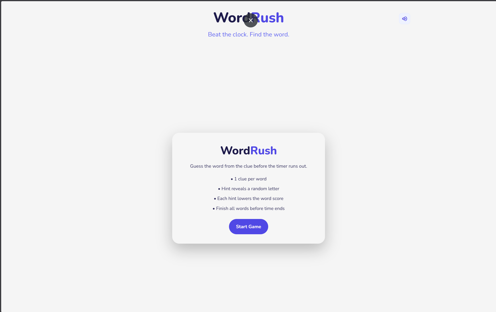
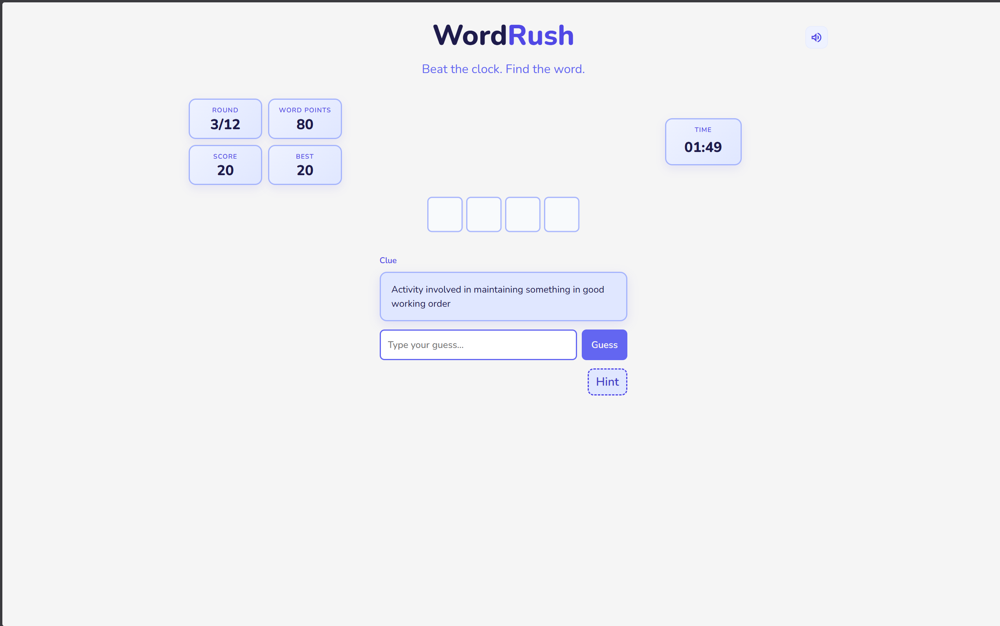
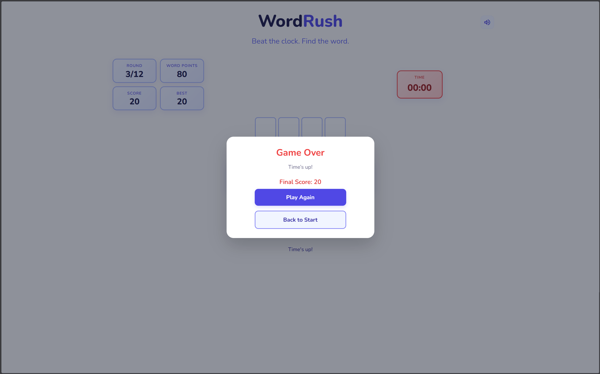

# WordRush

WordRush is a fast-paced word guessing game built with React. Players must guess words from clues before the timer runs out. The game features hints, scoring, animations, and a smooth responsive UI.

## Live Demo

https://wordrush-alpha.vercel.app/

---

## Features

- Timed gameplay
- Clue-based word guessing
- Local word bank (no API required)
- Difficulty progression
- Hint system (reveals letters with score penalty)
- Score + best score tracking
- Sound effects with mute toggle
- Animations for correct/wrong guesses
- Fully responsive (mobile + desktop)
- Restart & game-over flows

---
## Screenshots




---
## Tech Stack

- React
- Vite
- CSS Modules
- JavaScript
- Natural (WordNet) for word generation

---

## Getting Started

### Install dependencies

```bash
npm install
```
### Run locally

```bash
npm run dev
```
### Build for production

```bash
npm run build
```
### Preview production build
```bash
npm run preview
```
---
## Word Bank Generation

### Generate common words
```bash
npm run generate:words
```

### Generate word bank with clues
```bash
npm run generate:bank
```
### Scripts are located in:
tools/

### Generated data is stored in:
src/data/

---

## Project Structure
```
src/
  assets/
  components/
  data/
  pages/
  styles/
  utils/

public/
tools/
```
---

## Gameplay

* Each round presents a clue
* Player types the correct word
* Hints reveal letters but reduce score
* Game ends when time runs out or all words are solved

---

## Status

Alpha version deployed
